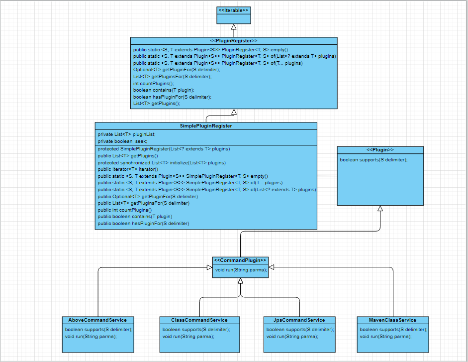

## Intent

Plugin works best in a language that supports reflection because the factory can cnostruct implementations without 
compile-time dependencies on them. When using reflection, the configuration file must contain mappings of interface 
names to implementation class names. The factory can sit independently in a framework package and needn't be changed 
when you add new implementations to your configuration options. 

## Explanation

Real world example

The plugin model provides the user with an interface to extend the program, allowing the user to add functionality to the
program by writing plug-ins outside of the program itself, in accordance with the specified interface. 
          

**Programmatic Example**

Let's define the plugin structure first. There's interface `Plugin` and implementation 
The support method is used to check whether activate the current plugin according to the delimiter 


```java
public interface Plugin<S>{
    boolean supports(S delimiter);
}
```
For the pluginRegister interface. I define some methods to initialize the plugin, count plugin and obtain the plugin.

```java
package src.main;

import java.util.*;
import java.util.Arrays;

public interface PluginRegister<T extends Plugin<S>,S> extends Iterable<T>{
    public static <S,T extends Plugin<S>> PluginRegister<T,S> empty(){
        return of(Collections.emptyList());
    }


    @SafeVarargs
    public static<S,T extends Plugin<S>> PluginRegister<T , S> of(T... plugins){
        return of(Arrays.asList(plugins));
    }

    public static<S,T extends Plugin<S>> PluginRegister<T,S> of(List<? extends T> plugins){
        return of(plugins);
    }


    Optional<T> getPluginFor(S delimiter);

    List<T> getPluginsFor(S delimiter);

    boolean contains(T plugin);

    boolean hasPluginFor(S delimiter);

    List<T> getPlugins();

    int countPlugins();
}


```

SimplePluginRegister implementation class is the default implementation class of plugin. 
User could based their own business to achieve and extend the PluginRegister interface. \

```java
package src.main;


import org.springframework.util.Assert;

import java.util.*;
import java.util.stream.Collectors;

public class SimplePluginRegister<T extends Plugin<S>,S> implements PluginRegister<T,S>,Iterable<T> {
    private List<T> pluginList;
    private boolean seek;

    protected SimplePluginRegister(List<? extends T> pluginList){
        Assert.notNull(pluginList, "pluginList can not be null");
        this.pluginList = pluginList == null ? new ArrayList<>() : (List<T>) pluginList;
        this.seek = false;
    }

    protected  synchronized  List<T> initialize(List<T> pluginList){
        Assert.notNull(pluginList,"pluginList can not be null");
        return pluginList.stream().filter(it -> it !=null).collect(Collectors.toList());
    }


    public List<T> getPlugins() {
        if(!seek){
            this.pluginList = initialize(this.pluginList);
            this.seek = true;
        }
        return  pluginList;
    }

    public static <S,T extends Plugin<S>> SimplePluginRegister<T,S> empty(){
        return of(Collections.emptyList());
    }


    @SafeVarargs
    public static<S,T extends Plugin<S>> SimplePluginRegister<T , S> of(T... plugins){
        return of(Arrays.asList(plugins));
    }

    public static<S,T extends Plugin<S>> SimplePluginRegister<T,S> of(List<? extends T> plugins){
        return of(plugins);
    }


    @Override
    public Optional<T> getPluginFor(S delimiter) {
        Assert.notNull(delimiter,"delimiter con not be null");
        return getPlugins().stream().filter(it -> it.supports(delimiter)).findFirst();
    }

    @Override
    public List<T> getPluginsFor(S delimiter) {
        Assert.notNull(delimiter,"delimiter con not be null");
        return getPlugins().stream().filter(it -> it.supports(delimiter)).collect(Collectors.toList());
    }

    @Override
    public boolean contains(T plugin) {
        return getPlugins().contains(plugin);
    }

    @Override
    public boolean hasPluginFor(S delimiter) {
        return getPluginFor(delimiter).isPresent();
    }


    @Override
    public int countPlugins() {
        return getPlugins().size();
    }

    @Override
    public Iterator<T> iterator() {
        return getPlugins().iterator();
    }
}

```

I define the run method in CommandPlugin, which will implement the function of plugin 
```java


public interface CommandPlugin extends Plugin<String> {
    void run(String parameter);
}
```
In the APP class,I initialize the plugin,I initialize the three  four plugins, And they are initialized
in a static code block via new SimplePluginRegistry.

```java
package src.main;

import org.slf4j.Logger;
import org.slf4j.LoggerFactory;
import src.main.service.command.*;

import java.util.Arrays;
import java.util.Optional;

public class APP {
    private static final Logger log = LoggerFactory.getLogger(APP.class);

    private static SimplePluginRegister<CommandPlugin,String> simplePluginRegister;

    static {
        simplePluginRegister = new SimplePluginRegister<CommandPlugin, String>(Arrays.asList(new JpsCommandService(),new MavenCommandClass()
        ,new AboveCommandService(),new ClassCommandPlugin()));

    }

    public static void main(String[] args) {
        if(args == null || args.length <= 0 ){
            log.info("There is no args, exit");
        }

        String value = null;
        String command = null;
        if(args.length > 1){
            value = args[1];
        }
        Optional<CommandPlugin> pluginFor = simplePluginRegister.getPluginFor(command);
        String value2 = value;
        pluginFor.ifPresentOrElse(cp -> {
            log.info("run",cp.getClass().getSimpleName());
            cp.run(value2);
        },new Thread(() -> log.info("wrong command")));
    }
}

```

## Class diagram



## Applicability
Use the plugin pattern. 

When User need to implement new function on external App. It is really convenient to add new plugin. 


